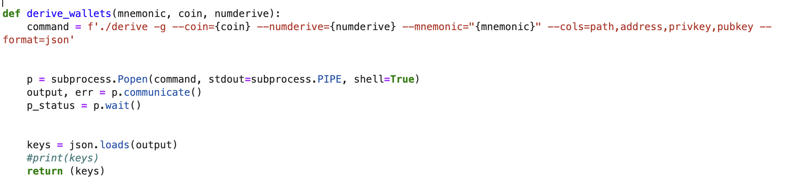
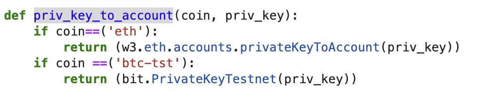
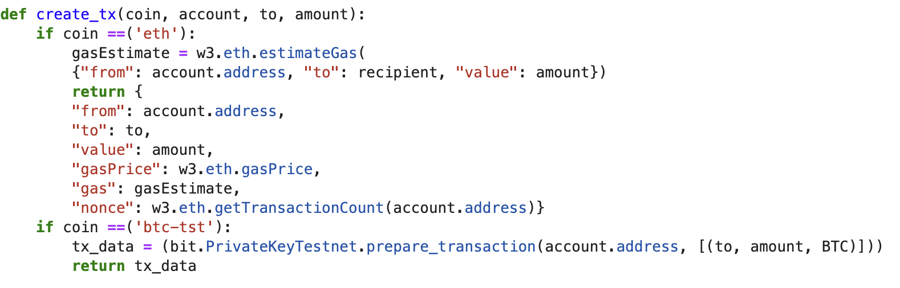
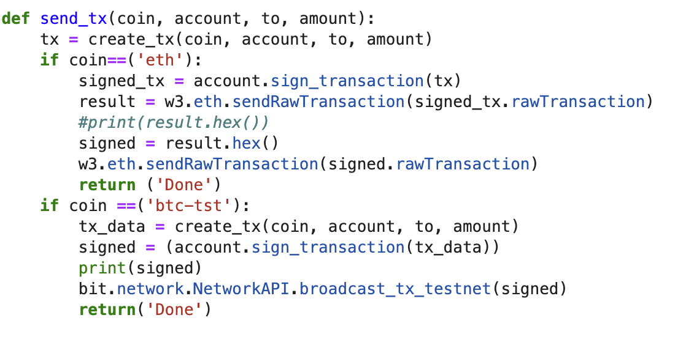
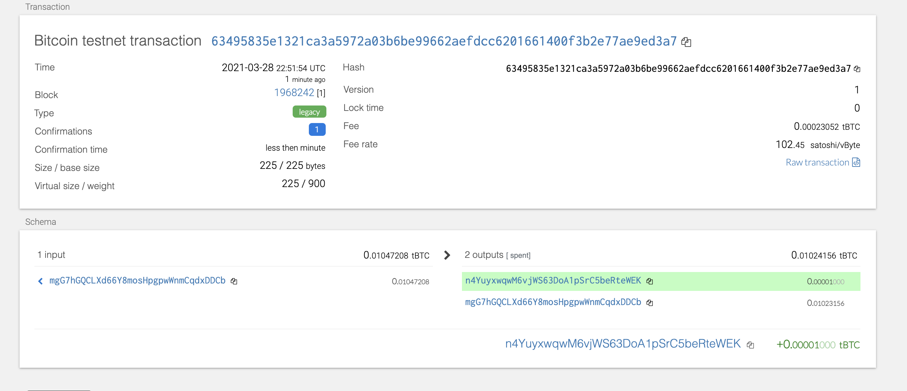

# Multi-Blockchain Wallet in Python

## Introduction

This is a basic multi blockchain wallet built in Python3 from hd-wallet-derive.

The primary function of the wallet is to allow transactions on a variety of block chains via unix CLI commands in Python.

### Functions

#### Derive wallets

This function takes in three parameters.
* mnenomic, this is the 12-word mnenomic used to generate the wallet.
* coin, this is the coin type. The coin types for this wallet are stored in constants.py. Currently eth and btc-test are supported. They are stored as ETH and BTCTEST.
* numderive, this parameter controls the number of child keys to generate.

The function will return a json containing the requested number of keys for a specific coin.

#### priv_key_to_account

This function converts a private key string into an account object which can be used by bit and web3

#### create_tx

This function will create a raw, unsigned transaction that contains the data needed to transact.
Generally you wouldn't call this function directly as it is called by the send_tx function.

It takes in 4 parameters coin, account, to, amount
* The coin that we are transacting
* An account object generated by the priv_key_to_account function.
* The account we are sending to.
* The amount of the coin we are sending.

#### send_tx

This is the primary sending function in the wallet. It's used to sign and send transactions. It calls the prior function create_tx. As a result, it calls the same parameters.

### Installation

1. Clone directory
2. Install the requirements by running the following command: pip install -r requirements.txt
3. Install hd-wallet-derive
    1. cd into the hd-wallet-derive folder from terminal (cd hd-wallet-derive)
    2. run the following commands in terminal  
    php -r "readfile('https://getcomposer.org/installer');" | php
    php composer.phar install
    3. Confirm that installation was successful with the following command.
    ./hd-wallet-derive.php -g --key=xprv9tyUQV64JT5qs3RSTJkXCWKMyUgoQp7F3hA1xzG6ZGu6u6Q9VMNjGr67Lctvy5P8oyaYAL9CAWrUE9i6GoNMKUga5biW6Hx4tws2six3b9c
4. Create a symlink called derive for the hd-wallet-derive/hd-wallet-derive.php script into the top-level project
directory, like so: ln -s hd-wallet-derive/hd-wallet-derive.php derive
 

